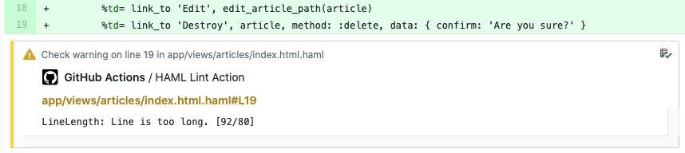

<div align="center">

  
  
  
  [](/CHANGELOG.md)
  
  [](#contributors)
</div>

# :white_check_mark: HAML Lint Action

A GitHub Action to run [HAML-Lint](https://github.com/sds/haml-lint) against your code and create annotations in the GitHub UI.

- [:white_check_mark: HAML Lint Action](#whitecheckmark-haml-lint-action)
  - [:page_facing_up: Introduction](#pagefacingup-introduction)
  - [:bulb: Usage](#bulb-usage)
    - [:package: Example Workflow](#package-example-workflow)
    - [:moneybag: Available Inputs](#moneybag-available-inputs)
  - [:warning: Gotchas](#warning-gotchas)
  - [:camera_flash: Screenshots](#cameraflash-screenshots)
  - [:bookmark: Changelog](#bookmark-changelog)
  - [:sos: Contributing](#sos-contributing)
  - [:rotating_light: Code of Conduct](#rotatinglight-code-of-conduct)
  - [:copyright: License](#copyright-license)
  - [:robot: Check Out My Other Ruby GitHub Actions](#robot-check-out-my-other-ruby-github-actions)
  - [✨ Contributors](#%e2%9c%a8-contributors)

## :page_facing_up: Introduction

GitHub Actions are an amazing new tool that can dramatically improve productivity while using the GitHub platform. While it is not hard to write a custom GitHub action to run HAML-Lint on your codebase, this action takes that functionality one step further using the checks API. After the HAML Lint Action runs HAML-Lint against your code, it will create annotations that you can easily view, matched up with the offending code.

Since GitHub actions and the checks API are continually changing, it is possible that there will be breaking API changes that affect this action. If so, please open an issue and I will look into it as soon as I can.

## :bulb: Usage

Add the following to your GitHub action workflow to use HAML Lint Action:

```yaml
- name: HAML Lint
  uses: andrewmcodes/haml-lint-action@v0.0.1
  with:
    file_paths: 'app/**/*.html.haml'
    fail_level: 'error'
  env:
    GITHUB_TOKEN: ${{ secrets.GITHUB_TOKEN }}
```

### :package: Example Workflow

Here is an example workflow file incorporating HAML Lint Action:

```yaml
name: HAML Lint

on: [push]

jobs:
  build:
    runs-on: ubuntu-latest
    steps:
    - uses: actions/checkout@v1
    - name: HAML Lint
      uses: andrewmcodes/haml-lint-action@v0.0.1
      with:
        file_paths: 'app/**/*.html.haml'
        fail_level: 'error'
      env:
        GITHUB_TOKEN: ${{ secrets.GITHUB_TOKEN }}
```

### :moneybag: Available Inputs

Refer to the [official `haml-lint` documentation](https://github.com/sds/haml-lint#usage) for more information on the `haml-lint` options.

| ****Input Parm Name**** | ****Required**** | ****Default Value**** | ****`haml-lint` option**** |                                                                                  ****Description****                                                                                  |              **Example**              |
| :---------------------: | :--------------: | :-------------------: | :------------------------: | :-----------------------------------------------------------------------------------------------------------------------------------------------------------------------------------: | :-----------------------------------: |
|         bundle          |      false       |         false         |             no             |                If you want to use a version of a gem you maintain this is your best bet. **NOTE:** action run time will increase relative to the size of your Gemfile.                |                `true`                 |
|       file_paths        |      false       |     `app/views/`      |            yes             |                                         Define the paths you wish to be linted per run. Multiple paths can be on one line by adding a space.                                          |        `'app/**/*.html.haml'`         |
|         version         |      false       |   _latest release_    |             no             |                                                                   Define a specific version of the `haml-lint` gem.                                                                   |              `'0.33.0'`               |
|     additional_gems     |      false       |                       |             no             |                                         Additional Gems can be installed via one line with spaces and commands are supported like a version.                                          | `'rubocop-rails rubocop-performance'` |
|       config_path       |      false       |                       |            yes             | By default, `haml-lint` will load any file with the name `.haml-lint.yml` as a configuration file. If you want to load a config file with a different name or path, specify the path. |       `'config/haml-lint.yml'`        |
|      exclude_paths      |      false       |                       |            yes             |                                                                 Define a list of paths to exclude from being linted.                                                                  |    `'app/views/home/*.html.haml'`     |
|       fail_level        |      false       |        `error`        |            yes             |                                                          Can define `error` or `warning` to cause haml-lint to error out on.                                                          |              `'warning'`              |

## :warning: Gotchas

Due to the GitHub Check Runs API, we can only return 50 annotations per run. See [here](https://developer.github.com/v3/checks/runs/#output-object) for more info.

## :camera_flash: Screenshots

<div style="margin-bottom:1rem;">


</div>



## :bookmark: Changelog

[View our Changelog](/CHANGELOG.md)

## :sos: Contributing

[Contributing Guide](/CONTRIBUTING.md)

## :rotating_light: Code of Conduct

[Code of Conduct](/CODE_OF_CONDUCT.md)

## :copyright: License

[MIT](/LICENSE.md)

## :robot: Check Out My Other Ruby GitHub Actions

- [andrewmcodes/rubocop-linter-action](https://github.com/andrewmcodes/rubocop-linter-action).
- [andrewmcodes/standardrb-action](https://github.com/andrewmcodes/standardrb-action).

## ✨ Contributors

Thanks goes to these wonderful people ([emoji key](https://allcontributors.org/docs/en/emoji-key)):

<!-- ALL-CONTRIBUTORS-LIST:START - Do not remove or modify this section -->
<!-- prettier-ignore -->
<table>
  <tr>
    <td align="center"><a href="https://www.andrewmason.me/"><br /><sub><b>Andrew Mason</b></sub></a><br /><a href="#infra-andrewmcodes" title="Infrastructure (Hosting, Build-Tools, etc)">🚇</a> <a href="https://github.com/andrewmcodes/haml-lint-action/commits?author=andrewmcodes" title="Documentation">📖</a> <a href="https://github.com/andrewmcodes/haml-lint-action/commits?author=andrewmcodes" title="Code">💻</a></td>
  </tr>
</table>

<!-- ALL-CONTRIBUTORS-LIST:END -->

This project follows the [all-contributors](https://github.com/all-contributors/all-contributors) specification. Contributions of any kind welcome!
